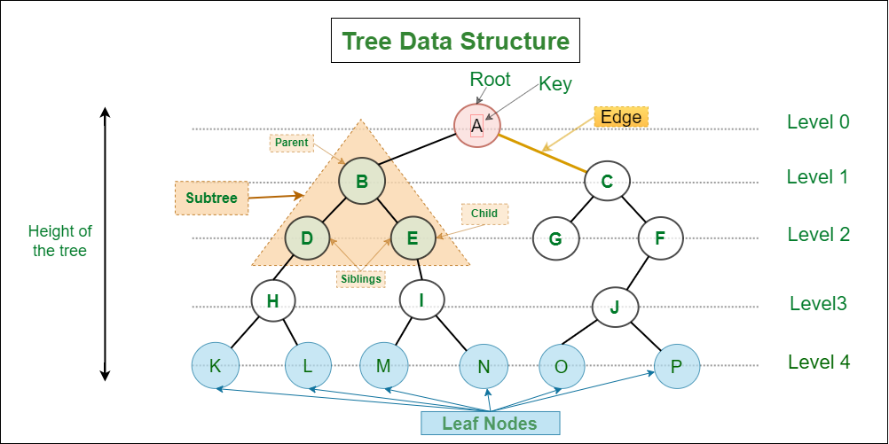

## <h1 style = "color: cyan;">Tree</h1>

#### Tree Data Structure (ট্রি ডাটা স্ট্রাকচার) হলো এমন একটি non-linear data structure, যেখানে ডাটা গুলো parent–child সম্পর্ক অনুযায়ী সাজানো থাকে। বাস্তব জীবনের গাছের মতো—একটা মূল (root) থেকে শাখা-প্রশাখা বের হয়।

### 🌳break the tree more

Tree হলো নোড (node) ও এজ (edge) দিয়ে গঠিত একটি কাঠামো যেখানে

একটি root node থাকে

root থেকে নিচের দিকে এক বা একাধিক child node থাকে

প্রতিটি child-এর আবার নিজস্ব child থাকতে পারে

picture for better understanding:

### 🌳Important term of tree:

🔹 Height

Root থেকে সবচেয়ে নিচের leaf পর্যন্ত সর্বোচ্চ লেভেল

🔹 Depth

কোনো নোড root থেকে কত লেভেল নিচে আছে

## 🌳Types of Tree:

1️⃣ Binary Tree

প্রতিটি নোডের সর্বোচ্চ ২টি child থাকতে পারে

2️⃣ Binary Search Tree (BST)

Left child < Parent

Right child > Parent

3️⃣ Full Binary Tree

প্রতিটি নোডের হয় ০ অথবা ২টি child

4️⃣ Complete Binary Tree

সব লেভেল পূর্ণ থাকে (শেষ লেভেল বাদে)

5️⃣ AVL Tree

Self-balancing BST

6️⃣ Red-Black Tree

## why Tree..?

✔ Hierarchical ডাটা প্রকাশ করতে
its maintain parent-child relationship for this reason we called it hierarchical data structure.
its flow is top to bottom.

✔ দ্রুত Search, Insert, Delete করার জন্য

✔ বাস্তব জীবনের structure বোঝাতে

## 🌳Applications of Tree:

Folder Structure (Computer)

Organization Hierarchy

Family Tree

HTML DOM

Compiler-এর Syntax Tree 🌟

## N arry Tree:

N arry Tree হলো এমন একটি tree structure যেখানে প্রতিটি নোডের সর্বোচ্চ N টি child থাকতে পারে। উদাহরণস্বরূপ, ternary tree হলো একটি N arry tree যেখানে প্রতিটি নোডের সর্বোচ্চ ৩টি child থাকতে পারে।

### properties of Node(When i implemant binary tree):

1. Val: নোডের ডাটা বা মান
2. Left: বাম দিকের child নোডের রেফারেন্স
3. Right: ডান দিকের child নোডের রেফারেন্স

## tree travarsal:

Tree traversal হলো tree structure-এর প্রতিটি নোডকে systematic ভাবে visit করার প্রক্রিয়া। প্রধানত তিন ধরনের tree traversal পদ্ধতি রয়েছে:

1. Pre-order Traversal: নোডকে প্রথমে visit করা হয়, তারপর বাম child এবং শেষে ডান child।
2. In-order Traversal: প্রথমে বাম child visit করা হয়, তারপর নোড এবং শেষে ডান child।
3. Post-order Traversal: প্রথমে বাম child visit করা হয়, তারপর ডান child এবং শেষে নোড।

#### Another important travaesal technique is Level-order Traversal, যেখানে নোডগুলো লেভেল বাই লেভেল visit করা হয়, উপরের লেভেল থেকে নিচের লেভেলে।
